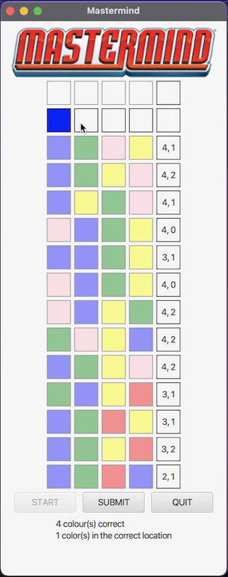

# Mastermind Game
 Interactive GUI for Mastermind board game using JavaFX

# Instructions/Notes

Download and install Eclipse IDE

Download zipped clone from repository, extract, and open as new eclipse project

Please refer to this youtube video for instructions on the installation/implementation of JavaFX for the Eclipse IDE (https://www.youtube.com/watch?v=bk28ytggz7E&t=317s)

# Contributers
Junior Green<<juniorgreen@cmail.carleton.ca>>

# Gallery

**Click to download mp4 of gameplay->**

